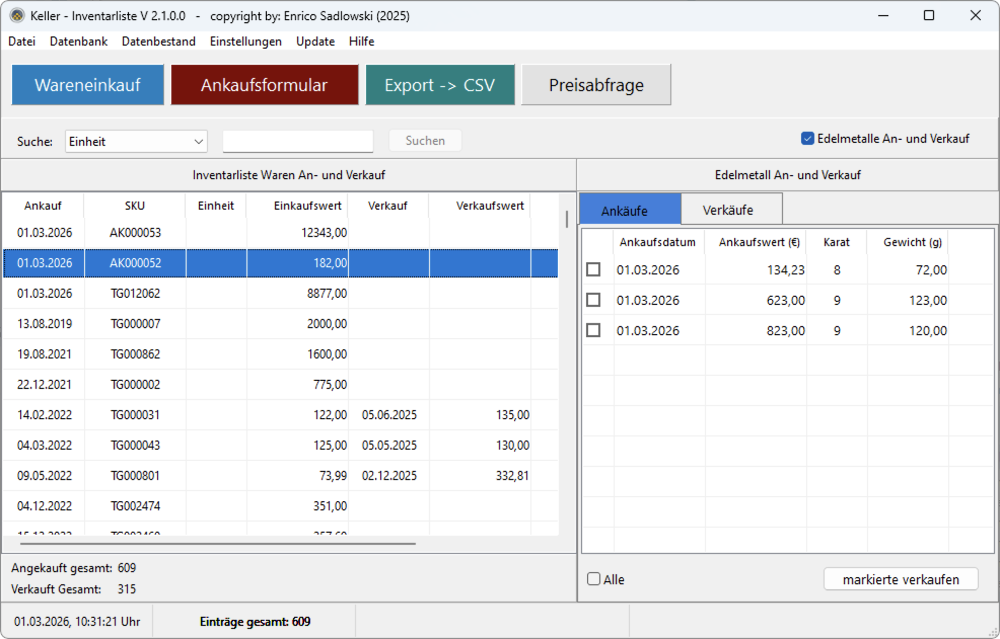
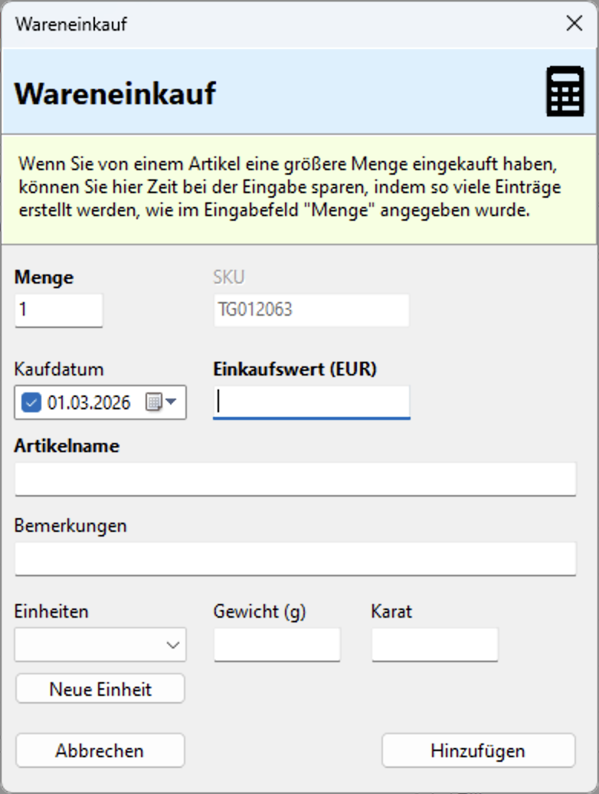
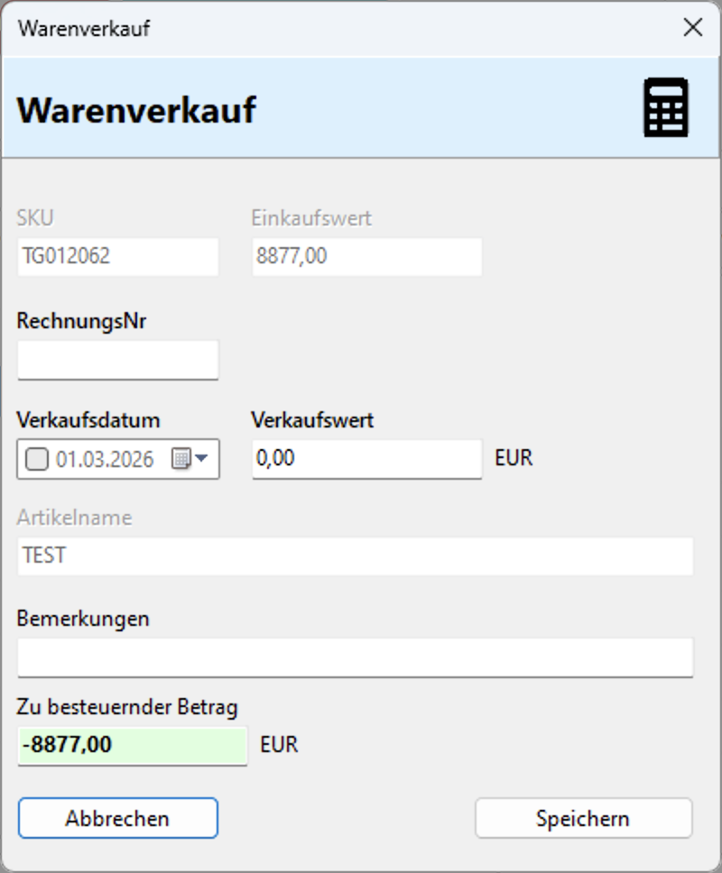
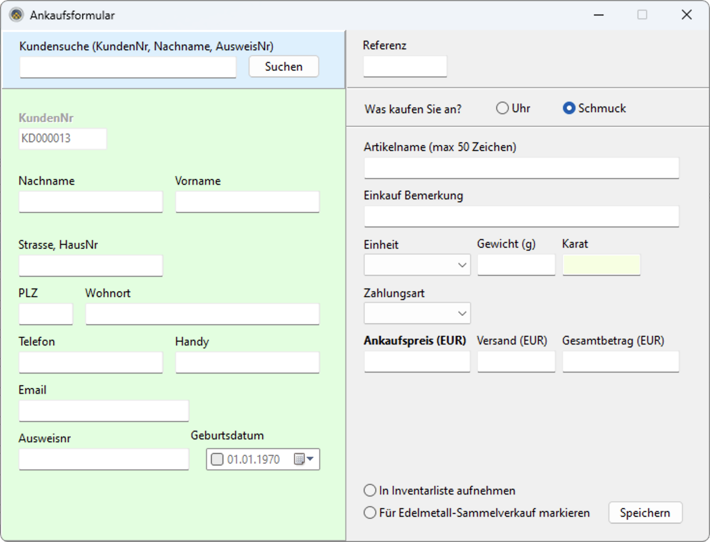
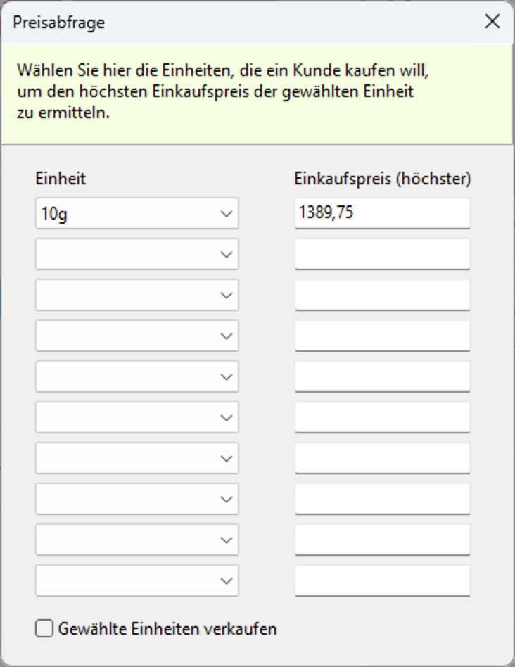

# Inventarliste V2

## Programm zum verwalten von An- und Verkäufen von Schmuck und Edelmetallen.

# Hauptanwendung

# Wareneinkauf

# Warenverkauf
Hier können Sie Uhren, Schmuck oder Edelmetalle verkaufen.

# Ankaufsformular
Im Ankaufsformular können Sie schnell Uhren, Schmuck oder Edelmetalle ankaufen. Uhren erscheinen anschließend in der Inventarliste. Bei Schmuck und Edelmetallen können Sie unten angeben, ob diese in der Inventarliste oder für den späteren Sammelverkauf gespeichert werden sollen.

# Preisabfrage
Hier wird der höchste Einkaufswert der gewählten, noch nicht verkauften  Einheit angezeigt.

